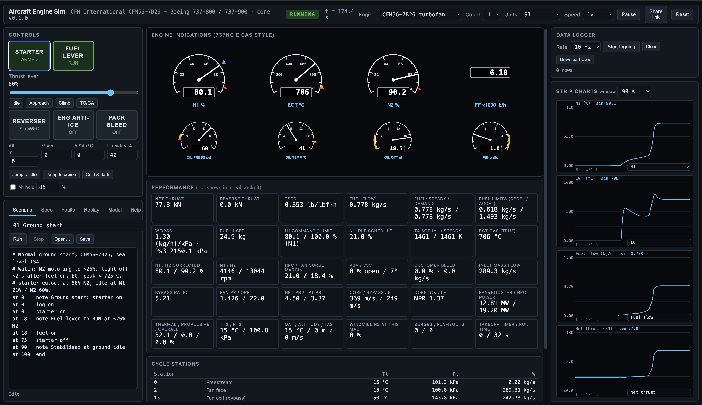

# Aircraft Engine Sim

[](LICENSE)
[](https://aircraftengine.fly.dev)



An educational IDE for aircraft engine simulation. The simulators are
physics-based models built from the published specifications of real
engines, with virtual cockpit instrumentation and a data logger. Everything
runs inside the browser: the web server only delivers static files, and the
simulation core is Rust compiled to WebAssembly.

Three engine families, each validated against its published data. Try it at
https://aircraftengine.fly.dev, no install needed.

> **Educational use only.** This is a teaching tool. It is not a certified
> flight training device, not a substitute for the aircraft flight manual or
> the engine manufacturer's documentation, and must not be used for
> operational, maintenance or airworthiness decisions. The models reproduce
> published figures; the proprietary parts of the real engines (component
> maps, control laws) are replaced by calibrated approximations described in
> [docs/MODEL.md](docs/MODEL.md).

| Engine | Type | Aircraft | Rating |
|---|---|---|---|
| CFM International CFM56-7B26 | two-spool high-bypass turbofan | Boeing 737-800/900 | 26,300 lbf |
| Lycoming O-360-A4M | 4-cylinder carburetted piston, fixed-pitch prop | Piper PA-28-181 Archer, Cessna 172 class | 180 hp |
| Pratt & Whitney Canada PT6A-114A | free-turbine turboprop, constant-speed prop | Cessna 208B Grand Caravan | 675 shp |

**What it teaches**

- Normal operation: ground start, idle, takeoff, climb, cruise, shutdown,
  with 737NG-style EICAS indications and the full station-by-station cycle
  visible next to them.
- The FADEC: N1 governing through fuel flow, Wf/Ps3 acceleration and
  deceleration schedules, flat rating (EGT-limited N1 on a hot day), idle
  schedules, bleed effects, reverse thrust.
- Abnormals: hot, hung and wet starts, compressor surge and surge cycling,
  flameout and auto-relight, windmill restart envelope, oil leak to seizure,
  fire drill, governor failure, instrument failure; all through injectable
  faults and 27 scripted lessons (15 turbofan, 6 piston, 6 turboprop).
- Validation: replay any CSV flight log (own logger output or external data),
  drive the model from the logged levers or N1, overlay the logged channels
  on the charts and tabulate the errors.
- Twin-engine operation with per-engine lever targeting and faults.
- Piston lessons: cold start and priming, magneto check with a fouled plug,
  takeoff and climb temperatures, leaning to peak EGT at altitude,
  carburettor icing, fuel starvation and restart.
- Turboprop lessons: start, torque versus ITT limits hot and high, propeller
  governing and feather, hot start on a weak battery, reverse on the landing
  roll, flameout and relight.
- The complete model documentation (equations, calibration, limits) is in
  [docs/MODEL.md](docs/MODEL.md) and in the IDE's Model tab.

```
aircraft-engine/
├── crates/
│   ├── engine-core/      Rust simulation core (no I/O, runs natively and as wasm)
│   │   ├── src/atmosphere.rs   ISA atmosphere, inlet total conditions
│   │   ├── src/spec.rs         Engine specification (ratings, geometry, cycle, limits)
│   │   ├── src/cycle.rs        Station-by-station thermodynamic cycle, nozzles, sizing
│   │   ├── src/engine.rs       Turbofan: FADEC, spool dynamics, start/shutdown, sensors, limits
│   │   ├── src/propeller.rs    Blade-element propeller with induced inflow (piston + turboprop)
│   │   ├── src/piston.rs       Lycoming O-360: induction, mixture, power, temperatures, starting
│   │   ├── src/turboprop.rs    PT6A-114A: gas generator, free power turbine, governor, start
│   │   ├── src/any.rs          Engine-kind dispatcher (one interface for wasm and CLI)
│   │   ├── src/logger.rs       Fixed-rate CSV data logger
│   │   └── tests/              validation.rs (turbofan, 29), piston.rs (11), turboprop.rs (12)
│   ├── engine-wasm/      wasm-bindgen bindings (one Simulator type for all engine kinds)
│   └── engine-cli/       Native runner: `spec [kind]`, `design`, `point`, `run <script> [--engine kind]`
├── web/                  TypeScript IDE (Vite). Static output in web/dist
│   ├── src/worker.ts       Simulation worker (owns the wasm engines, runs the clock)
│   ├── src/sim.ts          Main-thread client for the worker
│   ├── src/kinds.ts        Per-engine descriptors: dials, controls, faults, signals, readouts, lessons
│   ├── src/signals.ts      Signal registry (chart channels, log import patterns and units)
│   ├── src/instruments.ts  Round-dial SVG instruments
│   ├── src/charts.ts       Strip charts with cursor and log overlay
│   ├── src/scenario.ts     Scenario script parser and runner (timed and conditional lines)
│   ├── src/replay.ts       CSV flight-log import, mapping, replay and comparison
│   ├── src/share.ts        Share links (compressed state in the URL fragment)
│   ├── src/markdown.ts     Renders docs/MODEL.md into the Model tab
│   └── public/scenarios/   Lesson scripts
├── docs/MODEL.md         Model documentation (equations, calibration, limits)
├── Dockerfile, fly.toml  Static-site deployment (nginx) on Fly.io
└── scripts/build-wasm.sh
```

## Build and run

Requirements: Rust (stable, with the `wasm32-unknown-unknown` target),
`wasm-bindgen-cli` matching the crate version pinned in
`crates/engine-wasm/Cargo.toml`, optionally `wasm-opt`, Node 20+.

```bash
# 1. Validate the physics natively
cargo test -p engine-core

# 2. Build the wasm module into web/src/wasm
./scripts/build-wasm.sh

# 3. Run the IDE (dev server with hot reload)
cd web && npm install && npm run dev

# 4. Production: static files only
cd web && npm run build      # -> web/dist
cd web && npm run preview    # or any static server, e.g. python3 -m http.server -d dist
```

Deployment: the Dockerfile builds the wasm module and the web bundle in
stages and serves `web/dist` with nginx on port 8080. `fly deploy --ha
--remote-only` builds it on Fly's remote builder and runs two machines in the
region set in `fly.toml`. Any static host works just as well.

Scenario scripts (see `web/public/scenarios/`) use timed and conditional
lines; `ctl <control> <value>` sets any control of the selected engine:

```
at 0     starter on
at 18    fuel on
when n2 >= 59   note idle reached
at 70    tla 1.0
when n1 >= 95   fault surge
at 120   engine 2
at 120   fault ignition_fail on
# piston / turboprop controls through ctl:
at 0     ctl magnetos 3
at 2     ctl primer 3
at 0     ctl prop_lever 1
when ng >= 13   ctl condition_lever 1
```

Native tools without a browser:

```bash
cargo run -p engine-cli -- point 100            # turbofan takeoff point, SL static
cargo run -p engine-cli -- point 85 10668 0.78  # N1 85% at FL350 M0.78
cargo run -p engine-cli -- spec piston          # default spec JSON of an engine kind
cargo run -p engine-cli -- run web/public/scenarios/01-ground-start.txt > log.csv
cargo run -p engine-cli -- run web/public/scenarios/piston-01-cold-start.txt --engine piston > log.csv
cargo run -p engine-cli -- run web/public/scenarios/turboprop-01-start.txt --engine turboprop > log.csv
```

## Architecture

The simulation runs in a dedicated Web Worker (so it is not throttled in a
background tab) and the UI renders 30 state snapshots per second. The server
only serves static files; nothing about a session leaves the browser. Share
links put the scenario, spec and settings into the URL fragment; edits are
also kept in the browser's local storage.

Each engine kind is a Rust module behind the `AnyEngine` dispatcher and a
`KindDef` descriptor in `web/src/kinds.ts`. Adding an engine means: a spec
struct and model in `crates/engine-core`, a variant in `any.rs`, validation
tests, and a descriptor listing its dials, controls, faults, signals,
readouts and lessons. The spec JSON carries a `kind` tag; a document without
one is read as a turbofan spec.

## What the models reproduce

**Piston (O-360, PA-28-181 POH):** full-throttle static 2,350 rpm / 160 hp /
13.6 gal/h; 8,000 ft full throttle 2,550 rpm, 72 % power, 10.6 gal/h leaned;
idle 740 rpm at 12 inHg; magneto drop ~56 rpm each; climb CHT ~365 °F, cruise
~300 °F; cold start needs prime, carburettor ice forms in the 10 °C humid band
and clears with carb heat.

**Turboprop (PT6A-114A, 208B POH):** 675 shp at 100 % Ng, takeoff ITT 684 °C
and 424 lb/h, torque 1,866 ft·lb at 1,900 rpm, static thrust ~2,600 lbf;
idle Ng 52 %, ITT ~500 °C, 136 lb/h; 10,000 ft cruise 1,390 ft·lb at 302 lb/h;
ground start ~28 s with ITT peak ~640 °C; weak-battery hot start past 1,090 °C;
torque limited at sea level, ITT limited hot and high.

**Turbofan (CFM56-7B26):** published figures from the FAA type certificate
data sheet, the 737NG FCOM and CFM data are inputs: rated thrust, flat rating, fan diameter, mass flow,
bypass ratio, pressure ratios, N1/N2 at 100%, idle speeds, all EGT, speed and
oil limits, starter and start envelope. The validation suite checks that the
model lands on the published operating points:

| Point | Model | Published / expected |
|---|---|---|
| Takeoff thrust, SL ISA | 26,300 lbf (by sizing) | 26,300 lbf |
| Takeoff fuel flow | ~9,300 lb/h (TSFC 0.355) | ~9,000–10,000 lb/h |
| Takeoff EGT | ~857 °C | 800–900 °C (limit 950) |
| Overall pressure ratio | 32.7 | 32.7 |
| Ground idle N1 / N2 | 21 % / 60 % | 21 % / 60 % |
| Ground idle fuel flow, EGT | ~1,350 lb/h, ~450 °C | ~1,000–1,400 lb/h, 400–480 °C |
| Cruise FL350 M0.78, N1 85 % | ~4,200 lbf, TSFC 0.62 | 4,000–5,500 lbf, 0.60–0.65 |
| Idle to 95 % takeoff thrust | ~6 s from ground idle | ≤ 5 s from flight idle (FAR 33.73) |
| Ground start, fuel-on to idle | ~32 s, EGT peak ~600 °C | 30–60 s, limit 725 °C |

## What is approximated

Component maps (fan, booster, HPC, turbines) and the FADEC control laws are
proprietary. They are replaced by:

- power-law component characteristics against corrected speed, calibrated to
  the published points above;
- a steady-state N2(N1) relation fitted to cockpit indications;
- turbine inlet temperature fixed by core-nozzle flow continuity (the same
  physical constraint that fixes it in the real engine);
- a fuel-based FADEC: proportional N1 governor with feed-forward, clamped by
  Wf/Ps3 acceleration and deceleration schedules; the LP spool integrates the
  resulting turbine power surplus, the HP spool follows its operating line.

The whole model is in the JSON spec shown in the IDE, so every assumption can
be inspected and changed.

## Sources

The published figures behind the calibrations come from the FAA type
certificate data sheets (E00055EN for the CFM56-7B, E-286 for the O-360,
E4EA for the PT6A), the Boeing 737NG FCOM limitations and engine indication
chapters, the Piper PA-28-181 and Cessna 208B pilot's operating handbooks,
the Lycoming O-360 operator's manual, manufacturer-published performance data
and FAR Part 33. No proprietary data is included. Trademarks (CFM, Lycoming,
Pratt & Whitney Canada, Boeing, Piper, Cessna) belong to their owners and are
used only to identify the engines and aircraft modelled.

## Contributing

Issues and pull requests are welcome; see [CONTRIBUTING.md](CONTRIBUTING.md).
Questions, teaching ideas and show-and-tell go in GitHub Discussions. Real
flight logs you are allowed to share are the most valuable contribution.

## License

MIT, see [LICENSE](LICENSE). Copyright (c) 2026 Andre Paquette.
